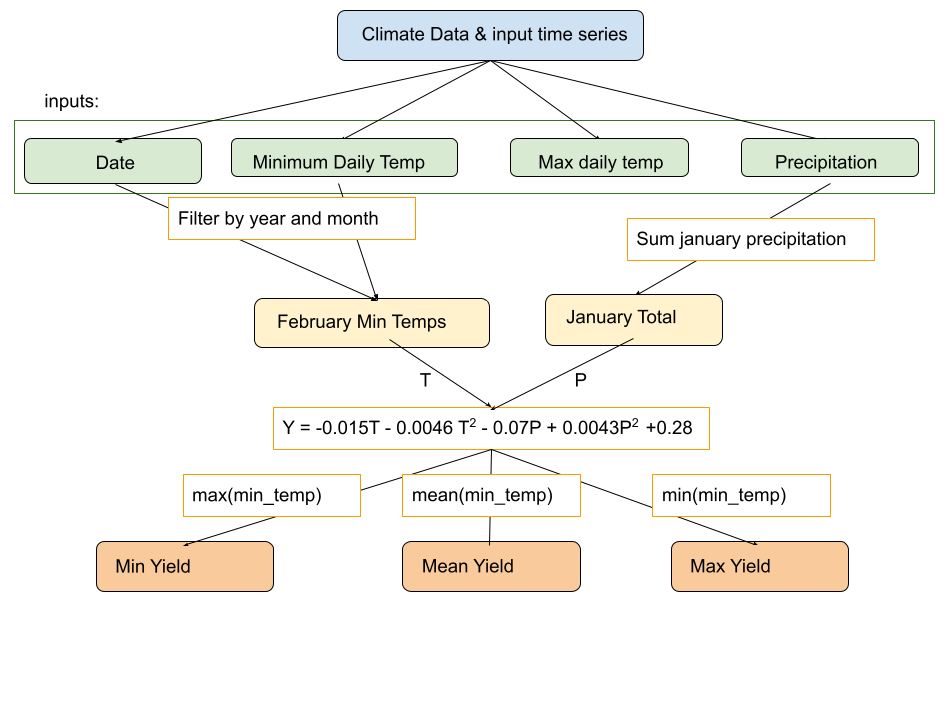

```{r setup, include=FALSE}
knitr::opts_chunk$set(echo = TRUE)

library(tidyverse)
library(here)
library(janitor)
```



```{r}
#read in the data 
climate <- read.table(here("data", "clim.txt")) %>% 
  row_to_names(row_number = 1) %>% 
  mutate_all(as.numeric) 
```

```{r}
#source function
source(here("R", "almond_modelR.R"))
```
 
```{r}
#run function on climate data 
yield_anomaly <- almond_modelR(clim_data = climate)
yield_anomaly
```
 
```{r}
#sensitivity analysis 

pcoeff_sample <- rnorm(mean=0.07, sd = 0.01, n=20)

pcoeff_sensitivity <- pcoeff_sample %>% 
  map(~almond_modelR(clim_data = climate, tmincoeff1 = 0.015, tmincoeff2 = 0.0046, pcoeff1 = .x, pcoeff2 = 0.0043))

head(pcoeff_sensitivity)

```
 
```{r}
#extract useful data
tmp = map_df(pcoeff_sensitivity, `[`, c("mean_yield", "min_yield", "max_yield"))
site2df = data.frame(mean = tmp$mean_yield, min=tmp$min_yield)
```


